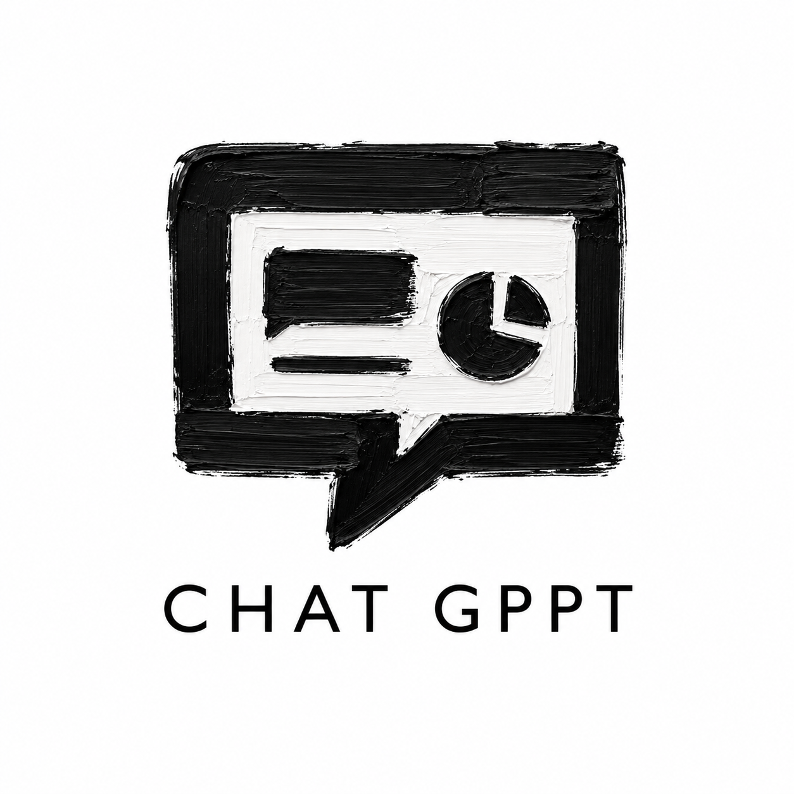

<p align="center">
  
</p>

<h1 align="center">CHAT GPPT / DeckForge</h1>

<p align="center">
  <a href="README.md"><strong>English</strong></a> · <a href="README.ko.md">한국어</a>
</p>

<p align="center">
  <strong>Build presentation decks with your own Codex — local-first, evidence-backed, and designed to avoid AI slop.</strong>
</p>

<p align="center">
  <a href="#quick-start"></a>
  <a href="#product-philosophy"></a>
  <a href="#bring-your-own-codex"></a>
  <a href="#evidence-first-qa"></a>
</p>

<p align="center">
  
  
  
  
  
  
  
  
</p>

---

## What is CHAT GPPT?

**CHAT GPPT** is the repository/product context for a local-first presentation generation system. The current desktop implementation is named **DeckForge**.

It is not trying to be another one-shot “AI PPT generator.” The core bet is different:

> **정확하게 작업하는 게 가장 빠르다.**<br>
> The fastest deck is the one that avoids rework through a structured, evidence-backed workflow.

Instead of asking an AI to make a whole deck from a vague prompt, CHAT GPPT guides the work through approved intermediate artifacts:

```text
Brief
→ live interview
→ research pack
→ deck plan
→ design system
→ layout prototype
→ controlled full-slide generation
→ review / repair
→ export
```

---

## Product Philosophy

### 1. Brief-to-Deck, not Prompt-to-PPT

Most AI presentation tools start from a prompt and immediately generate slides. That is fast at the beginning, but expensive later: unclear messages, weak evidence, inconsistent design, fake charts, generic layouts, and heavy manual cleanup.

CHAT GPPT starts from a **brief** and turns every important step into a reviewable artifact.

### 2. AI slop prevention through structure

The project treats quality as a system problem, not just a prompt-writing problem.

- One slide, one message.
- Claims and numbers need source/evidence context.
- Design systems are approved before slide generation.
- Layout and generation outputs carry provenance.
- Final export is blocked when evidence or lineage is contaminated.

### 3. Local-first desktop workflow

DeckForge is a Tauri desktop app. The goal is to keep the user’s working artifacts, project context, and execution path close to the local machine instead of forcing everything into a remote SaaS workflow.

### 4. Controlled full-slide image generation

The visual moat is not “HTML overlay on top of AI backgrounds.” The direction is:

```text
image model generates the complete 16:9 presentation slide raster
+ DeckForge controls it through contracts, reference/control images,
  prompt packages, visual gates, and targeted repair loops
```

Readable does not mean everything should be bold. Failed typography or layout should be fixed by regenerating/repairing under a stricter control contract, not by hiding broken text with overlays.

---

## Bring Your Own Codex

CHAT GPPT is designed around **BYO Codex**:

> Use the Codex access you already have instead of paying for yet another AI PPT subscription.

Codex is treated as a production worker inside the deck pipeline:

- interview question generation;
- brief creation;
- research and source reasoning;
- deck plan drafting;
- design system drafting;
- layout IR generation;
- QA / repair turns.

The app checks Codex connection when a live action actually needs Codex. Users can still create and prepare a project before connecting Codex.

---

## Core Capabilities

| Area | What DeckForge is built to do |
|---|---|
| Project workflow | Step-based deck production from brief to export |
| Live interview | Generate interview questions and turn answers into an approved brief |
| Research | Preserve source/evidence context instead of treating research as anonymous summary text |
| Planning | Convert approved brief and research into deck structure |
| Design system | Lock visual direction before generation |
| Layout | Create reviewable slide structure before final visuals |
| Full-slide generation | Generate complete 16:9 slide rasters under control contracts |
| Repair loop | Target failed axes instead of random full rerolls |
| Local desktop bridge | Use Tauri/Rust commands for Codex status, login, structured turns, and local project folders |
| Evidence gates | Treat machine-verifiable evidence as the source of truth |

---

## Architecture

```text
┌──────────────────────────────────────────────────────────────┐
│                       DeckForge Desktop                       │
│                    Tauri v2 + WebView UI                      │
└───────────────────────────────┬──────────────────────────────┘
                                │
                                ▼
┌──────────────────────────────────────────────────────────────┐
│                         Frontend UI                           │
│ React 19 / TanStack Router / Tailwind / Radix UI              │
│                                                              │
│ - project cockpit                                             │
│ - staged approval workflow                                    │
│ - live interview and text pipeline actions                    │
│ - research / design / layout / review surfaces                │
└───────────────────────────────┬──────────────────────────────┘
                                │ Tauri command / event bridge
                                ▼
┌──────────────────────────────────────────────────────────────┐
│                         Tauri Core                            │
│ Rust backend                                                  │
│                                                              │
│ - Codex login status                                          │
│ - Codex login terminal launch                                 │
│ - Codex App Server smoke / structured turn                    │
│ - local project folder creation / reveal                      │
└───────────────────────────────┬──────────────────────────────┘
                                │
                                ▼
┌──────────────────────────────────────────────────────────────┐
│                    Production Artifact Layer                  │
│                                                              │
│ InterviewBrief → ResearchPack → DeckPlan → DesignSystem       │
│ → LayoutIR → SlideContextBundle → GeneratedSlide → Export     │
└──────────────────────────────────────────────────────────────┘
```

---

## Repository Layout

```text
.
├── README.md
├── docs/
│   ├── assets/
│   │   └── chat-gppt-logo.png
│   └── ... project direction / architecture / release docs
└── deck-scribe-craft-07/
    ├── package.json
    ├── src/
    │   ├── components/deck/       # production workflow UI
    │   ├── lib/                   # deck domain, gates, providers, evidence logic
    │   └── routes/                # TanStack routes
    ├── src-tauri/
    │   ├── tauri.conf.json        # DeckForge desktop app config
    │   └── src/                   # Rust command bridge
    └── docs/                      # live-readiness and release evidence docs
```

> Current app source path: `deck-scribe-craft-07/`<br>
> Current desktop product name: `DeckForge`<br>
> Current Tauri version in config: `0.0.15`

---

## Quick Start

### Prerequisites

- [Bun](https://bun.sh/)
- Rust toolchain
- Tauri v2 prerequisites for your OS
- Codex CLI / Codex login for live production actions

### Run the desktop app

```bash
git clone https://github.com/sunseol/chatgppt.git
cd chatgppt/deck-scribe-craft-07
bun install
bun run tauri:dev
```

### Web-only development preview

```bash
cd deck-scribe-craft-07
bun install
bun run dev
```

### Build frontend assets

```bash
bun run build
```

### Build the Tauri desktop app

```bash
bun run tauri:build
```

---

## Development Commands

Run these commands from `deck-scribe-craft-07/`.

| Command | Purpose |
|---|---|
| `bun run dev` | Start Vite web dev server |
| `bun run tauri:dev` | Start Tauri desktop app in development |
| `bun run typecheck` | TypeScript type check |
| `bun test` | Run Bun test suite |
| `bun run build` | Build frontend and Tauri client assets |
| `bun run verify` | Typecheck + tests + build |
| `bun run rust:fmt` | Rust formatting check |
| `bun run rust:clippy` | Rust lint check |
| `bun run rust:test` | Rust tests |
| `bun run quality` | TypeScript and Rust quality gates |
| `bun run qa:frontend` | Frontend screenshot / UI QA harness |
| `bun run qa:package` | Native package QA helper |

---

## Evidence-first QA

This project follows a strict operating contract:

```text
Documentation does not imply Done.
AI says passed does not imply Done.
Done implies machine-verifiable evidence exists.
```

For implementation and release work, a report is never enough. The project expects executable evidence such as:

- test output;
- typecheck/build logs;
- generated evidence bundles;
- provenance metadata;
- artifact hashes;
- package QA records;
- clean-machine validation when release readiness is claimed.

---

## Current Status

This repository contains active product and implementation work. The current release documentation marks the live release decision as:

```text
Release decision: Blocked
```

That does **not** mean the app has no working pieces. It means final live release acceptance still requires stronger end-to-end evidence, including packaged-app live Codex runs, clean-machine validation, live source/evidence capture, benchmark runs, and final gate verification.

Use this README as a project overview, not as release certification.

---

## Security and Local Data

- Do not commit API keys, tokens, cookies, certificates, private keys, or signing passwords.
- Codex credentials and signing material should stay outside the repository.
- Local runtime outputs, build products, screenshots, and Lovable metadata are ignored where applicable.
- Release artifacts must carry provenance and hashes before they are treated as candidates.

---

## Roadmap

- [ ] Complete authenticated packaged-app live interview → brief → plan → design → layout flow.
- [ ] Produce live Research Pack with persisted source capture metadata.
- [ ] Strengthen controlled full-slide image generation contracts and repair loops.
- [ ] Record Golden Path E2E evidence bundle.
- [ ] Run clean-machine setup / UAT validation.
- [ ] Add signed release pipeline and platform-specific distribution flow.
- [ ] Decide and document repository license.

---

## Contributing

This project is still moving fast. Good contributions should preserve the project’s core constraints:

1. prefer structured workflow over one-shot generation;
2. preserve provenance and evidence;
3. keep local-first desktop behavior intact;
4. avoid fake/mock contamination in production paths;
5. improve controllability of full-slide generation rather than hiding failures with overlays.

Before opening a large change, write down the artifact it changes, the gate it affects, and the command that verifies it.

---

## Name Map

| Name | Meaning |
|---|---|
| `CHAT GPPT` / `chatgppt` | Repository and project context |
| `GPPT` | Product direction: AI-assisted design PPT workflow |
| `DeckForge` | Current Tauri desktop app implementation |
| `deck-scribe-craft-07` | Current app source directory |

---

<p align="center">
  <strong>CHAT GPPT is built for people who need decks they can actually submit — not just screenshots that look impressive for five seconds.</strong>
</p>
