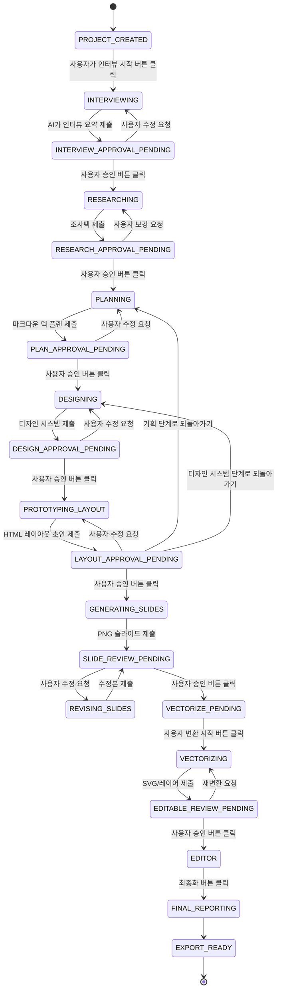

# PRD: Codex 기반 PPT 제작 데스크탑 앱

- 문서 버전: v0.1
- 작성일: 2026-06-17
- 제품 코드명: `DeckForge` 또는 `Codex Deck Studio`
- 문서 목적: Tauri 기반 로컬 데스크탑 앱으로, 사용자의 Codex/ChatGPT 인증을 연결하여 인터뷰, 조사, 슬라이드 기획, 이미지 기반 슬라이드 생성, 검증, 편집 가능한 SVG/레이어 변환, 최종 보고까지 강제 수행하는 초기 MVP의 제품 요구사항을 정의한다.

---

## 0. 한 줄 요약

사용자의 초기 프롬프트 하나를 기반으로, 앱이 **인터뷰 → 조사 → 마크다운 슬라이드 기획 → 디자인 시스템 확정 → HTML 레이아웃 프로토타입 승인 → 이미지 슬라이드 생성 → 검토/수정 → SVG/레이어 편집화 → 최종 보고** 절차를 강제 수행하고, 각 단계마다 사용자의 명시적 승인 버튼 없이는 다음 단계로 넘어가지 않는 로컬 데스크탑 PPT 제작 앱을 만든다.

---

## 1. 제품 비전

이 제품은 “AI가 예쁜 슬라이드 이미지를 만들어주는 도구”가 아니다.

이 제품의 목표는 다음에 가깝다.

> 사용자가 승인한 의도, 검증된 조사 자료, 고정된 디자인 시스템, 승인된 HTML 레이아웃 기준선, 추적 가능한 컨텍스트를 기반으로 완성형 슬라이드를 생성하고, 최종 결과물을 사용자가 직접 수정 가능한 형태로 제공하는 로컬 우선 PPT 제작 시스템.

핵심 차별점은 다음 네 가지다.

1. **강제 워크플로우**
   AI가 바로 슬라이드를 만들지 않고, 인터뷰, 조사, 기획, 생성, 검증, 보고 단계를 반드시 거친다.

2. **사용자 승인 기반 진행**
   각 단계마다 실제 UI 버튼을 눌러야만 다음 단계로 넘어간다.

3. **컨텍스트 일관성 설계**
   세션이 길어지고 병렬 생성이 발생하더라도, 모든 슬라이드가 같은 목적, 같은 디자인 시스템, 같은 조사 자료, 같은 덱 플랜을 참조한다.

4. **편집 가능한 최종 산출물**
   PNG 한 장으로 끝나지 않고, SVG 또는 레이어 단위 객체로 변환되어 Canva, 미리캔버스, PowerPoint처럼 직접 편집할 수 있어야 한다.

---

## 2. 문제 정의

현재 AI 기반 PPT 생성 방식은 다음 문제가 있다.

### 2.1 사용자 의도 오해

사용자는 “투자 제안서 느낌으로 만들어줘”라고 말하지만, 실제로 원하는 것은 다음 중 하나일 수 있다.

- 엔터프라이즈 B2B 세일즈덱
- 스타트업 투자 유치용 피치덱
- 내부 임원 보고용 의사결정 자료
- 강의용 시각 자료
- 브랜드 소개용 포트폴리오

초기 프롬프트만으로 바로 슬라이드를 만들면, 사용자의 상상과 AI의 작업 계획 사이에 큰 차이가 발생한다.

### 2.2 조사 없는 생성

AI가 사실처럼 보이는 수치, 시장 규모, 그래프, 사례를 임의로 만들면 슬라이드의 신뢰도가 붕괴한다. 특히 사업 보고, 투자 유치, 정책, 교육, 리서치 자료에서는 출처 없는 수치가 치명적인 결함이다.

### 2.3 디자인 일관성 붕괴

슬라이드를 병렬 생성하면 각 장이 서로 다른 템플릿처럼 보일 수 있다. 색상, 여백, 제목 위치, 차트 스타일, 아이콘 스타일, 시각 밀도가 흔들리면 덱 전체가 하나의 완성물처럼 보이지 않는다.

### 2.4 컨텍스트 파편화

에이전트 세션이 길어지면 다음 문제가 생긴다.

- 인터뷰에서 확정한 요구사항이 뒤 단계에서 누락됨
- 조사 단계의 수치가 슬라이드 생성 단계에서 왜곡됨
- 디자인 시스템이 일부 슬라이드에만 반영됨
- 수정 생성 시 원본 슬라이드의 구조가 크게 바뀜
- 병렬 생성 작업자마다 서로 다른 해석을 함

이 문제를 해결하려면 대화 기록을 계속 이어가는 방식이 아니라, **승인된 산출물을 구조화된 컨텍스트 그래프로 저장하고 각 단계가 이를 참조하는 방식**이 필요하다.

### 2.5 PNG 결과물의 편집 불가능성

이미지 생성 결과가 아무리 예뻐도, 사용자가 제목, 숫자, 도형, 그래프, 이미지 위치를 직접 수정할 수 없으면 실제 업무용 PPT 앱으로 쓰기 어렵다.

### 2.6 이미지 생성 전 레이아웃 검증 부재

이미지 생성 후에야 텍스트 과밀, 그래프 영역 부족, 제목 위계 불명확, 슬라이드 간 레이아웃 리듬 붕괴가 드러나면 수정 비용이 커진다.

따라서 이미지 생성 전에 승인된 마크다운 기획과 디자인 시스템을 바탕으로, 각 슬라이드의 배치, 정보 위계, 텍스트 밀도, 차트/이미지 영역, 출처 위치를 빠르게 검증하는 중간 표현이 필요하다.

---

## 3. 제품 목표

### 3.1 MVP 목표

초기 MVP는 다음을 달성해야 한다.

> 사용자가 로컬 데스크탑 앱에서 Codex/ChatGPT 인증을 연결한 뒤, 하나의 PPT 생성 요청을 입력하면, 앱이 강제 워크플로우에 따라 5~12장 분량의 16:9 슬라이드를 생성하고, 각 단계별 사용자 승인을 받은 뒤, 최종적으로 주요 텍스트와 객체를 편집 가능한 SVG/레이어 상태로 제공한다.

### 3.2 품질 목표

MVP의 품질 기준은 다음이다.

- 사용자 승인 없이 다음 단계 진행 불가
- 인터뷰 결과와 최종 슬라이드 간 의도 불일치 최소화
- 주요 주장과 수치에 출처 연결
- 모든 슬라이드가 같은 디자인 시스템을 따름
- 이미지 생성 전 HTML Layout Prototype으로 배치와 정보 구조를 검증
- 이미지 생성 결과의 AI slop 최소화
- 사용자가 제목, 본문, 주요 도형, 이미지 영역을 직접 편집 가능
- 최종 보고서에 출처, 승인 이력, 생성 이력, 검증 결과 포함

### 3.3 사업적 목표

초기 MVP는 다음 가설을 검증한다.

1. 사용자는 “바로 생성”보다 “검증된 단계형 생성”에 더 높은 신뢰를 느낀다.
2. 사용자 승인 기반 워크플로우는 결과물 품질을 높인다.
3. 컨텍스트 그래프 기반 병렬 생성은 디자인 일관성 붕괴를 줄인다.
4. HTML Layout Prototype 기반 레이아웃 승인 단계는 이미지 생성 비용과 재작업을 줄인다.
5. PNG → SVG/레이어 변환 품질이 일정 수준 이상이면 실제 편집형 PPT 제작 도구로 인식된다.

---

## 4. 비목표

MVP에서 하지 않는다.

- PowerPoint의 모든 기능을 구현하지 않는다.
- 복잡한 애니메이션을 지원하지 않는다.
- 모든 이미지 생성 결과를 완벽한 벡터 레이어로 복원하지 않는다.
- HTML/CSS 초안을 최종 디자인 산출물로 취급하지 않는다.
- 사용자가 자유 HTML/CSS/JavaScript를 직접 편집하는 웹 빌더를 만들지 않는다.
- 수십 장 이상의 대형 덱 생성을 우선 지원하지 않는다.
- 모든 산업별 전문 보고서 품질을 보장하지 않는다.
- 출처가 불명확한 통계를 사실처럼 생성하지 않는다.
- 사용자의 Codex/ChatGPT 인증 토큰을 앱 프론트엔드나 프로젝트 파일에 직접 저장하지 않는다.
- 일반 OpenAI API 호출과 Codex OAuth 세션의 권한 범위를 임의로 혼용하지 않는다.

---

## 5. 대상 사용자

### 5.1 1차 사용자

| 사용자 | 니즈 | 핵심 가치 |
|---|---|---|
| 스타트업 창업자 | 투자/제안 자료 빠른 제작 | 스토리라인, 디자인, 데이터 근거 |
| 기획자/PM | 내부 보고, 로드맵, 전략 자료 | 구조화된 메시지, 편집성 |
| 컨설턴트 | 리서치 기반 슬라이드 작성 | 출처, 논리 흐름, 디자인 일관성 |
| 마케터 | 캠페인/브랜드 덱 제작 | 비주얼 품질, 톤앤매너 |
| 교육자 | 강의 자료 제작 | 쉬운 설명, 시각화, 정확성 |

### 5.2 2차 사용자

- 디자이너: 초안 생성 후 수동 편집
- 리서처: 조사 자료 기반 보고서 초안 생성
- 영업팀: 고객사별 제안서 빠른 커스터마이즈
- 학생/연구자: 발표자료 초안 제작

---

## 6. 개발 환경 및 기술 전제

### 6.1 데스크탑 앱 런타임

MVP는 반드시 **Tauri 기반 데스크탑 앱**으로 구현한다.

#### 요구사항

| 항목 | 요구사항 |
|---|---|
| 앱 프레임워크 | Tauri v2 계열 |
| 프론트엔드 | TypeScript + React 또는 Svelte |
| 백엔드 | Rust 기반 Tauri Core |
| 로컬 저장소 | SQLite + 파일 시스템 아티팩트 저장소 |
| OS 지원 | MVP: macOS 우선, Windows/Linux는 Beta 또는 내부 테스트 |
| 네트워크 | 조사, 모델 호출, 인증에 필요한 경우만 사용 |
| 실행 방식 | 사용자가 설치 가능한 로컬 데스크탑 앱 |

#### Tauri 구조 원칙

- UI는 WebView에서 렌더링한다.
- 파일 시스템, 인증 상태 확인, 로컬 프로세스 실행, 아티팩트 저장은 Rust 백엔드에서 처리한다.
- 프론트엔드는 Tauri command 또는 event를 통해 Rust 백엔드를 호출한다.
- 보안상 모든 민감 작업은 renderer가 아니라 Rust 백엔드에서 수행한다.
- Tauri permission/capability를 명시적으로 설정하여 필요한 명령만 프론트엔드에 노출한다.

---

### 6.2 Codex / ChatGPT 인증 요구사항

사용자는 자신의 Codex/ChatGPT 계정을 연결하여 자신의 AI 사용 권한을 통해 작업을 수행할 수 있어야 한다.

#### 인증 목표

| 항목 | 요구사항 |
|---|---|
| 기본 인증 | 사용자의 Codex/ChatGPT OAuth 기반 로그인 |
| 대체 인증 | API Key 입력은 fallback 또는 개발자 모드로만 제공 |
| 토큰 저장 | 앱 프론트엔드, 프로젝트 파일, 로그에 토큰 저장 금지 |
| 인증 상태 확인 | 앱 시작 시 Codex 로그인 상태 확인 |
| 로그아웃 | 앱 내에서 Codex 로그아웃 또는 연결 해제 가능 |
| 실패 대응 | 브라우저 OAuth 실패 시 device-code flow 안내 |

#### 구현 방향

MVP에서는 다음 순서로 접근한다.

1. **Codex CLI 또는 Codex SDK 기반 인증 재사용**
   - 앱은 Codex의 공식 로그인 흐름을 직접 대체하지 않는다.
   - 사용자가 `Sign in with ChatGPT` 또는 Codex 로그인 흐름을 완료하면, 앱은 Codex 런타임의 로그인 상태를 확인한다.
   - 필요한 경우 `codex login status`에 준하는 상태 확인 명령을 Rust 백엔드에서 실행한다.

2. **Codex App Server / SDK Adapter**
   - 앱 내부에는 `CodexProvider` 추상화를 둔다.
   - 이 어댑터는 Codex SDK 또는 Codex CLI/App Server를 통해 작업 스레드를 생성하고 실행한다.
   - 앱은 Codex의 내부 auth 파일을 직접 파싱하거나 복사하지 않는다.

3. **Direct API Adapter 분리**
   - 이미지 생성 API나 특정 OpenAI API 호출이 Codex OAuth 세션으로 직접 지원되지 않는 경우를 대비해 `OpenAIImageProvider`를 별도로 둔다.
   - 이 모드는 사용자 API Key, 조직 인증, 과금 정책이 필요할 수 있다.
   - MVP 기획상 “사용자의 Codex OAuth를 연결한다”는 요구사항은 필수이나, 일반 OpenAI API 호출 권한과 Codex 로그인 토큰의 범위는 분리해서 설계한다.

#### 중요한 제품 가정

`Codex OAuth로 사용자의 AI를 사용한다`는 요구는 제품 핵심 요구사항이다. 단, 개발 단계에서 다음을 반드시 검증해야 한다.

- Codex CLI/SDK가 Tauri 앱에서 안정적으로 호출 가능한지
- Codex OAuth 세션을 써서 텍스트 기획, 조사 보조, 검증 작업을 안정적으로 수행할 수 있는지
- GPT Image 2 계열 이미지 생성 호출이 Codex 경유로 가능한지, 아니면 API Key 기반 이미지 API가 필요한지
- 사용자의 ChatGPT 플랜/워크스페이스 권한과 앱 기능 범위가 어떻게 매핑되는지

이 불확실성을 감추지 않기 위해 MVP 설계는 반드시 Provider Adapter 패턴을 사용한다.

```text
AIProvider
  ├─ CodexProvider            # 사용자 Codex/ChatGPT 로그인 기반 작업 실행
  ├─ OpenAIImageProvider      # 이미지 API 직접 호출이 필요한 경우
  ├─ MockProvider             # 테스트/CI용 더미 응답
  └─ LocalProvider            # 향후 로컬 모델/온디바이스 테스트용
```

---

### 6.3 이미지 생성 모델 전제

슬라이드 PNG 생성의 핵심 모델은 GPT Image 2 계열을 우선 타깃으로 한다.

#### 요구사항

- 텍스트 프롬프트로 슬라이드 이미지를 생성할 수 있어야 한다.
- 승인된 HTML 레이아웃 스크린샷을 구성 참조 이미지로 사용할 수 있어야 한다.
- 기존 이미지를 입력으로 받아 부분 수정 또는 전체 수정 생성이 가능해야 한다.
- 16:9, 4:3 등 PPT에 적합한 화면 비율을 지원해야 한다.
- 한국어 텍스트가 포함된 슬라이드의 가독성을 검증해야 한다.
- 이미지 생성 결과는 최종 편집 가능화를 위한 중간 산출물이며, 최종 산출물은 PNG 한 장으로 끝나지 않는다.
- 이미지 모델은 HTML 레이아웃 스크린샷을 최종 웹 UI 스타일로 복제하지 않고, 정보 위계와 상대 배치를 유지한 프레젠테이션 디자인으로 재해석해야 한다.

#### 운영 원칙

- 정확한 수치, 그래프, 표는 이미지 모델에게 임의로 그리게 하지 않는다.
- 데이터 기반 차트는 앱에서 직접 렌더링하고, 이미지 생성 결과 또는 SVG 레이어에 삽입한다.
- 제목, 본문, 수치, 캡션은 최종적으로 편집 가능한 텍스트 객체로 재구성한다.
- 이미지 모델은 레이아웃, 분위기, 배경, 시각 콘셉트, 일러스트, 카드 구조, 전체적인 디자인 초안을 담당한다.

---

### 6.4 컨텍스트 파편화 방지 요구사항

이 제품에서 가장 중요한 기술 요구사항 중 하나는 **컨텍스트 설계**다.

#### 금지되는 방식

다음 방식은 사용하지 않는다.

```text
사용자 프롬프트 → 긴 대화 → 슬라이드1 생성 → 슬라이드2 생성 → ... → 각 세션 기억에 의존
```

이 방식은 세션이 길어질수록 다음 문제가 생긴다.

- 슬라이드별 디자인이 달라짐
- 조사 결과가 일부 슬라이드에만 반영됨
- 사용자 승인 사항이 누락됨
- 병렬 생성 작업자마다 서로 다른 컨텍스트를 가짐
- 수정 생성 시 원본과 전혀 다른 결과가 나옴

#### 채택해야 하는 방식

다음 구조를 사용한다.

```text
User Prompt
  ↓
Interview Brief
  ↓ 승인
Research Pack
  ↓ 승인
Deck Plan Markdown
  ↓ 승인
Design System
  ↓ 승인
Frozen Deck Context
  ↓
Slide Context Bundles
  ↓ 병렬 생성
Generated Slides
  ↓ 검증
Editable Layer Model
  ↓
Final Report
```

모든 생성 작업자는 대화 기록 전체가 아니라, 다음 구조화된 컨텍스트 번들을 받는다.

```json
{
  "deck_context_version": "deckctx_0007",
  "project_brief": "approved_brief_v3",
  "research_pack": "research_pack_v2",
  "design_system": "design_system_v4",
  "deck_plan": "deck_plan_v5",
  "slide_spec": "slide_04_v2",
  "source_map": ["claim_001", "dataset_003"],
  "global_constraints": [
    "16:9 canvas",
    "use approved palette only",
    "keep title area consistent",
    "no unsourced statistics",
    "keep text editable later"
  ]
}
```

#### 컨텍스트 원칙

| 원칙 | 설명 |
|---|---|
| 승인 산출물 우선 | 대화 기록보다 승인된 JSON/Markdown 산출물이 우선한다. |
| 버전 고정 | 승인된 산출물은 버전과 해시를 가진다. |
| 하위 단계 무효화 | 상위 산출물이 바뀌면 이후 산출물은 자동 무효화된다. |
| 병렬 작업 동일 컨텍스트 | 모든 병렬 슬라이드 생성 작업은 같은 Deck Context 버전을 사용한다. |
| 슬라이드별 최소 컨텍스트 | 각 작업자는 전체 히스토리 대신 필요한 구조화 패키지만 받는다. |
| 출처 연결 | 모든 주장과 차트는 `claim_id`, `source_id`, `dataset_id`를 가진다. |
| 디자인 시스템 강제 | 모든 슬라이드 프롬프트에 동일한 디자인 시스템이 포함된다. |

---

## 7. 핵심 워크플로우

### 7.1 전체 단계

| 단계 | 이름 | 산출물 | 사용자 승인 |
|---:|---|---|---|
| 0 | 프로젝트 생성 | Project Shell | 필요 |
| 1 | 인터뷰 | Interview Brief | 필요 |
| 2 | 조사 | Research Pack | 필요 |
| 3 | 마크다운 슬라이드 기획 | Deck Plan Markdown | 필요 |
| 4 | 디자인 시스템 생성 | Design System | 필요 |
| 5 | HTML Layout Prototype 생성 | HTML/CSS + Layout PNG + DOM Layers | 필요 |
| 6 | 슬라이드 이미지 생성 | Slide PNGs | 필요 |
| 7 | 사용자 검토/재생성 | Revised Slide PNGs | 필요 |
| 8 | SVG/레이어 변환 | Editable Layer Model | 필요 |
| 9 | 에디터 편집 | Edited Deck | 선택/필요 |
| 10 | 최종 보고/내보내기 | PPTX/SVG/PNG + Report | 최종 승인 |

### 7.2 상태머신



### 7.3 승인 버튼 요구사항

각 단계의 승인 버튼은 단순 UI 장식이 아니라 상태 전이를 발생시키는 유일한 방법이어야 한다.

| 버튼 | 동작 |
|---|---|
| 인터뷰 결과 승인 | 조사 단계 시작 가능 |
| 조사 결과 승인 | 슬라이드 기획 단계 시작 가능 |
| 슬라이드 기획 승인 | 디자인 시스템 단계 시작 가능 |
| 디자인 시스템 승인 | HTML Layout Prototype 생성 가능 |
| HTML Layout Prototype 승인 | 슬라이드 이미지 생성 가능 |
| 슬라이드 PNG 승인 | SVG/레이어 변환 가능 |
| SVG/레이어 승인 | 편집/내보내기 가능 |
| 최종 승인 | 최종 리포트와 파일 내보내기 |

#### 승인 불변 조건

- 승인 전 다음 단계 실행 버튼은 비활성화되어야 한다.
- 승인 버튼 클릭 시 현재 산출물의 해시를 저장한다.
- 승인 이후 사용자가 상위 단계 산출물을 수정하면 이후 단계는 자동으로 `invalidated` 상태가 된다.
- `invalidated` 상태의 결과물은 최종 산출물로 내보낼 수 없다.

---

## 8. 기능 요구사항

### 8.1 프로젝트 생성

#### FR-001: 새 프로젝트 생성

사용자는 새 PPT 프로젝트를 생성할 수 있어야 한다.

##### 입력

- 프로젝트명
- 슬라이드 목적의 초기 프롬프트
- 기본 화면 비율: 16:9 또는 4:3
- 언어: 한국어, 영어, 혼합
- 예상 슬라이드 수

##### 출력

- 프로젝트 ID
- 로컬 프로젝트 폴더
- 초기 상태: `PROJECT_CREATED`

##### 수용 기준

- 프로젝트 생성 후 로컬 저장소에 `project.json`이 생성된다.
- 사용자는 언제든 앱을 껐다 켜도 프로젝트 목록에서 다시 열 수 있다.
- 생성 직후 인터뷰 단계 외 다른 단계는 비활성화된다.

---

### 8.2 Codex 인증 연결

#### FR-010: Codex/ChatGPT 로그인 연결

사용자는 앱에서 자신의 Codex/ChatGPT 계정을 연결할 수 있어야 한다.

##### 요구사항

- 앱 설정 화면에 `Codex 연결` 섹션이 있어야 한다.
- 사용자는 브라우저 기반 로그인 또는 device-code flow를 통해 로그인할 수 있어야 한다.
- 로그인 성공 후 앱은 인증 모드와 연결 상태를 표시한다.
- 인증 실패 시 명확한 오류와 재시도 경로를 제공한다.

##### 수용 기준

- 로그인 전에는 AI 실행 단계가 잠겨 있다.
- 로그인 후 `CodexProvider`가 정상 health check를 통과한다.
- 사용자가 로그아웃하면 이후 AI 실행이 중단된다.
- 인증 토큰은 프론트엔드 상태, 로그, 프로젝트 아티팩트에 노출되지 않는다.

---

### 8.3 인터뷰 단계

#### FR-020: 사용자 목적 명확화 인터뷰

앱은 초기 프롬프트를 바탕으로 사용자에게 필요한 질문을 하고, 작업 브리프를 구조화해야 한다.

##### 반드시 수집할 필드

| 필드 | 설명 |
|---|---|
| 목적 | 발표, 제안, 투자, 보고, 교육 등 |
| 청중 | 임원, 고객, 투자자, 학생, 대중 등 |
| 원하는 결과 | 설득, 승인, 이해, 구매, 학습 등 |
| 핵심 메시지 | 덱 전체를 관통하는 한 문장 |
| 분량 | 슬라이드 수 |
| 화면 비율 | 16:9 또는 4:3 |
| 언어 | 한국어/영어/혼합 |
| 톤앤매너 | 전문적, 미래지향적, 미니멀, 고급 등 |
| 필수 포함 요소 | 수치, 제품, 로고, 사례, 도표 등 |
| 금지 요소 | 과장, 특정 표현, 특정 스타일 등 |
| 성공 기준 | 사용자가 결과물을 평가할 기준 |

##### 인터뷰 출력

```json
{
  "brief_id": "brief_v3",
  "goal": "투자 유치용 피치덱",
  "audience": "초기 VC 및 엔젤 투자자",
  "desired_outcome": "문제의 크기와 솔루션의 확장성을 5분 안에 이해",
  "slide_count": 8,
  "aspect_ratio": "16:9",
  "language": "ko",
  "tone": ["professional", "modern", "credible"],
  "must_include": ["시장 규모", "문제 정의", "솔루션", "비즈니스 모델"],
  "must_avoid": ["과장된 수치", "출처 없는 시장 규모"],
  "success_criteria": ["투자자가 후속 미팅을 요청할 수준의 명확성"]
}
```

##### 수용 기준

- 사용자의 명시 지시가 브리프에 반영되어야 한다.
- 모호하거나 충돌하는 요구사항은 `open_questions`로 표시되어야 한다.
- 인터뷰 승인 전 조사 단계로 넘어갈 수 없다.

---

### 8.4 조사 단계

#### FR-030: 조사팩 생성

앱은 승인된 인터뷰 브리프를 바탕으로 자료 조사를 수행해야 한다.

##### 조사 원칙

- 정부, 국제기구, 공신력 있는 연구기관, 원자료, 기업 공식자료를 우선한다.
- 주요 주장에는 출처가 있어야 한다.
- 주요 수치에는 단위, 기준연도, 지역, 정의가 있어야 한다.
- 그래프는 이미지가 아니라 원천 데이터로 재현 가능해야 한다.
- 상충되는 자료는 하나를 숨기지 않고 차이를 설명한다.
- 불확실한 내용은 `uncertain`으로 표시한다.

##### 산출물

```text
/research
  sources.json
  claims.json
  datasets/
  charts/
  fact_check_report.md
```

##### Claim 구조

```json
{
  "claim_id": "claim_001",
  "statement": "한국 전기차 신규 등록 대수는 2025년에 전년 대비 증가했다.",
  "source_ids": ["source_003"],
  "dataset_ids": ["dataset_002"],
  "confidence": "high",
  "needs_user_review": false,
  "slide_candidates": [3, 4]
}
```

##### 수용 기준

- 출처 없는 핵심 주장은 슬라이드 기획에 사용할 수 없다.
- 주요 수치 오류는 치명 결함으로 처리한다.
- 조사 결과 승인 전 슬라이드 기획으로 넘어갈 수 없다.

---

### 8.5 마크다운 슬라이드 기획

#### FR-040: Deck Plan Markdown 생성

앱은 조사 결과를 바탕으로 슬라이드별 계획을 마크다운으로 생성하고 사용자 승인을 받아야 한다.

##### 출력 예시

```markdown
# Deck Plan

## 공통 정보
- 목적: 투자 유치용 피치덱
- 청중: 초기 VC 및 엔젤 투자자
- 화면 비율: 16:9
- 총 슬라이드 수: 8
- 핵심 메시지: AI 기반 PPT 제작의 병목은 생성이 아니라 검증과 편집성이다.

## Slide 1. Title
- 제목: 검증 가능한 AI 슬라이드 제작 시스템
- 역할: 덱의 주제와 신뢰 기반 포지셔닝 제시
- 핵심 메시지: 단순 생성형 PPT가 아니라 승인·조사·편집성을 갖춘 제작 시스템
- 시각화 방향: 미니멀한 제품 히어로 이미지 + 강한 타이포그래피
- 사용할 근거: 없음
- 편집 가능 요소: 제목, 부제, 날짜, 로고
- 사용자 확인 필요: 브랜드명 확정

## Slide 2. Problem
- 제목: AI PPT 생성의 4가지 실패 지점
- 역할: 문제 정의
- 핵심 메시지: 의도 오해, 조사 부재, 디자인 불일치, 편집 불가능성이 핵심 병목
- 시각화 방향: 4분할 카드 레이아웃
- 사용할 근거: 사용자 인터뷰 브리프, 제품 가설
- 편집 가능 요소: 카드 제목, 카드 설명, 아이콘
```

##### 수용 기준

- 모든 슬라이드는 역할, 핵심 메시지, 시각화 방향, 근거, 편집 가능 요소를 가져야 한다.
- 사용자 승인 전 디자인 시스템 생성으로 넘어갈 수 없다.
- 사용자가 수정한 마크다운 내용은 이후 Slide Spec에 반영되어야 한다.

---

### 8.6 디자인 시스템 생성

#### FR-050: 덱 디자인 시스템 생성

앱은 승인된 Deck Plan을 바탕으로 덱 전체에 적용될 디자인 시스템을 생성해야 한다.

##### 디자인 시스템 필수 항목

| 항목 | 설명 |
|---|---|
| Canvas | 16:9 또는 4:3, 기준 해상도 |
| Grid | 컬럼 수, 거터, 안전 여백 |
| Color Tokens | 배경, 텍스트, Primary, Secondary, Accent |
| Typography | 제목, 부제, 본문, 캡션, 숫자 스타일 |
| Layout Rules | 제목 위치, 본문 폭, 이미지 영역 규칙 |
| Component Rules | 카드, 차트, 아이콘, 인용, 표 스타일 |
| Visual Language | 미니멀, 컨설팅, 에디토리얼, 브랜드풍 등 |
| Negative Rules | 사용 금지 스타일, 과한 효과, 작은 글씨 등 |

##### 출력 예시

```json
{
  "design_system_id": "ds_v4",
  "canvas": {
    "ratio": "16:9",
    "base_size": { "width": 1920, "height": 1080 },
    "safe_margin": { "x": 96, "y": 72 }
  },
  "grid": {
    "columns": 12,
    "gutter": 24
  },
  "colors": {
    "background": "#F7F4EF",
    "text_primary": "#111111",
    "text_secondary": "#555555",
    "primary": "#1F4E79",
    "accent": "#FFB000"
  },
  "typography": {
    "title": { "style": "bold geometric sans", "min_px": 56, "max_px": 84 },
    "body": { "style": "clean sans", "min_px": 28, "max_px": 38 },
    "caption": { "style": "clean sans", "min_px": 18, "max_px": 24 }
  },
  "negative_rules": [
    "do not use random gradients",
    "do not use tiny unreadable text",
    "do not change title location across slides",
    "do not invent chart values"
  ]
}
```

##### 수용 기준

- 디자인 시스템 승인 전 HTML Layout Prototype을 생성할 수 없다.
- 디자인 시스템 승인 전 슬라이드 이미지를 생성할 수 없다.
- 모든 슬라이드 생성 프롬프트는 동일한 `design_system_id`를 참조해야 한다.
- 디자인 시스템은 이후 사용자가 직접 수정 가능해야 한다.

---

### 8.7 HTML Layout Prototype 생성

#### FR-060: HTML Layout Prototype 생성

앱은 승인된 마크다운 슬라이드 기획과 승인된 디자인 시스템을 바탕으로, 이미지 생성 전에 각 슬라이드의 정보 배치, 시각적 위계, 텍스트 밀도, 차트/이미지 영역, 출처 위치를 검증하기 위한 HTML/CSS 기반 레이아웃 초안을 생성해야 한다.

이 단계의 산출물은 최종 디자인이 아니며, 이미지 생성과 후속 SVG/레이어 편집화를 위한 구조적 기준점이다.

##### 핵심 원칙

HTML Layout Prototype은 다음을 책임진다.

- 정보 배치
- 시각적 위계
- 텍스트 밀도 확인
- 차트/이미지 영역 확보
- 출처 및 주석 위치 확보
- 편집 가능한 레이어 구조 정의

HTML Layout Prototype은 다음을 책임지지 않는다.

- 최종 아트 디렉션
- 고급 그래픽 표현
- 감성적 이미지 스타일
- 완성형 비주얼 디자인
- 최종 타이포그래피 품질

##### 입력

- 승인된 사용자 브리프
- 승인된 조사 결과
- 승인된 마크다운 슬라이드 기획
- 승인된 디자인 시스템
- 슬라이드별 출처 맵
- 슬라이드별 편집 가능 요소 목록

##### 산출물

각 슬라이드마다 다음 산출물을 생성한다.

```text
/layout_prototypes/{layout_prototype_id}/
  deck.css
  layout_manifest.json
  slide_01.html
  slide_01_layout.png
  slide_01_dom_layers.json
  slide_01_layout_validation.json
```

##### 제한된 컴포넌트 시스템

HTML은 자유 형식으로 생성하지 않고, 사전에 정의된 슬라이드 컴포넌트 시스템 안에서 생성해야 한다.

초기 MVP에서 허용하는 컴포넌트는 다음과 같다.

- CoverHero
- Agenda
- SectionDivider
- KeyMessage
- TwoColumn
- ChartWithInsight
- MetricCards
- ComparisonTable
- Timeline
- ImageWithCaption
- ClosingSummary

임의의 레이아웃 패턴, 임의 색상, 임의 폰트 크기, 임의 장식 요소를 생성해서는 안 되며, 모든 HTML은 승인된 디자인 토큰과 컴포넌트 규칙을 사용해야 한다.

##### DOM 레이어 메타데이터

각 HTML 요소는 후속 레이어 복원을 위해 `data-layer`, `data-role`, `data-source-id`, `data-editable` 속성을 가져야 한다.

```html
<section class="slide" data-slide-id="slide_04" data-layout="chart-with-insight">
  <header data-layer="header">
    <h1 data-layer="title" data-role="heading" data-editable="true">시장 성장의 핵심 지표</h1>
    <p data-layer="subtitle" data-role="subtitle" data-editable="true">최근 5년간 수요와 공급이 동시에 확대되고 있습니다.</p>
  </header>

  <main data-layer="body">
    <div data-layer="chart" data-role="chart" data-source-id="dataset_02" data-editable="true"></div>
    <aside data-layer="insight-cards" data-role="metric-group">
      <div data-layer="metric-card" data-role="metric-card" data-editable="true"></div>
      <div data-layer="metric-card" data-role="metric-card" data-editable="true"></div>
      <div data-layer="metric-card" data-role="metric-card" data-editable="true"></div>
    </aside>
  </main>

  <footer data-layer="source-note" data-role="source" data-source-id="source_01" data-editable="true"></footer>
</section>
```

렌더링 후 브라우저의 bounding box를 추출해 다음 구조를 저장해야 한다.

```json
{
  "slide_id": "slide_04",
  "layout_prototype_id": "layout_proto_v3",
  "layers": [
    {
      "id": "slide_04_title",
      "role": "title",
      "type": "text",
      "text": "시장 성장의 핵심 지표",
      "editable": true,
      "bounds": { "x": 96, "y": 72, "w": 920, "h": 80 }
    },
    {
      "id": "slide_04_chart",
      "role": "chart",
      "type": "chart_placeholder",
      "source_dataset": "dataset_02",
      "editable": true,
      "bounds": { "x": 96, "y": 260, "w": 980, "h": 520 }
    }
  ]
}
```

##### 렌더링 및 사용자 승인

HTML은 로컬 렌더러로 렌더링되어 슬라이드별 PNG 미리보기를 만든다.

```text
slide_01.html -> slide_01_layout.png
slide_02.html -> slide_02_layout.png
slide_03.html -> slide_03_layout.png
```

사용자는 이 단계에서 최종 디자인 완성도가 아니라 배치, 정보량, 시각화 영역, 슬라이드 흐름을 확인한다.

사용자에게 다음 안내를 명확히 표시해야 한다.

```text
이 화면은 최종 디자인이 아니라 레이아웃 초안입니다.
텍스트 위치, 정보량, 시각화 영역, 슬라이드 흐름을 확인해주세요.
최종 시각 스타일은 다음 이미지 생성 단계에서 개선됩니다.
```

사용자는 다음 중 하나를 선택할 수 있다.

- 레이아웃 승인
- 슬라이드별 수정 요청
- 전체 레이아웃 방향 수정
- 마크다운 기획 단계로 되돌아가기
- 디자인 시스템 단계로 되돌아가기

##### 이미지 생성에서의 사용 방식

승인된 HTML Layout Prototype은 이미지 생성 단계에서 구성 참조로 사용된다.

이미지 생성 입력에는 다음이 포함되어야 한다.

- 승인된 마크다운 슬라이드 기획
- 승인된 디자인 시스템
- HTML 레이아웃 스크린샷
- DOM 레이어 구조
- 출처 맵
- 금지 조건
- 슬라이드별 생성 지시

이미지 생성 모델은 HTML 스크린샷을 그대로 복제하지 않고, 정보 위계와 상대적 배치를 유지하면서 더 완성도 높은 프레젠테이션 디자인으로 재해석해야 한다.

##### 금지 사항

HTML Layout Prototype은 다음을 포함해서는 안 된다.

- 임의의 JavaScript
- 외부 네트워크 리소스
- 승인되지 않은 폰트 로딩
- 출처 없는 숫자
- 조사 단계에 없는 그래프
- 임의 생성 로고
- 무의미한 장식 요소
- 지나치게 많은 카드 UI
- 랜딩페이지식 섹션 디자인
- 일반 웹 대시보드처럼 보이는 구성

##### 보안 요구사항

AI가 생성한 HTML은 신뢰할 수 없는 코드로 간주한다.

따라서 다음 보안 제약을 적용한다.

- JavaScript 실행 금지
- 외부 URL 요청 금지
- `iframe` 금지
- `script` 태그 금지
- inline event handler 금지
- Tauri API 접근 금지
- sandboxed WebView 또는 별도 렌더러에서만 실행
- 렌더링 전 HTML sanitizer 통과
- 허용된 CSS 속성 whitelist 적용

##### 수용 기준

- 사용자가 레이아웃을 승인하기 전에는 이미지 생성 단계로 넘어갈 수 없다.
- 모든 슬라이드가 지정된 화면 비율로 렌더링되어야 한다.
- 텍스트가 안전 여백 밖으로 나가지 않아야 한다.
- 제목, 본문, 출처가 시각적으로 구분되어야 한다.
- 슬라이드별 주요 메시지가 5초 안에 파악 가능해야 한다.
- 차트와 표는 조사 데이터와 연결되어야 한다.
- 모든 편집 가능 요소는 DOM layer metadata를 가져야 한다.
- 전체 덱의 여백, 제목 위치, 정보 밀도가 일관되어야 한다.

---

### 8.8 Frozen Deck Context 생성

#### FR-070: Deck Context Bundle 생성

앱은 인터뷰, 조사, 기획, 디자인 시스템, HTML Layout Prototype 승인 후 슬라이드 생성을 위한 고정 컨텍스트 번들을 생성해야 한다.

##### 산출물

```json
{
  "deck_context_id": "deckctx_0012",
  "project_id": "project_abc",
  "approved_artifacts": {
    "brief_id": "brief_v3",
    "research_pack_id": "research_v2",
    "deck_plan_id": "plan_v5",
    "design_system_id": "ds_v4",
    "layout_prototype_id": "layout_proto_v3"
  },
  "hash": "sha256:...",
  "created_at": "2026-06-17T12:00:00+09:00",
  "locked": true
}
```

##### 수용 기준

- 모든 병렬 생성 작업은 같은 `deck_context_id`를 사용한다.
- 모든 병렬 생성 작업은 같은 `layout_prototype_id`와 DOM layer metadata를 사용한다.
- 사용자가 상위 산출물을 수정하면 새 `deck_context_id`가 생성된다.
- 이전 컨텍스트로 생성된 슬라이드는 구버전 표시를 가져야 한다.

---

### 8.9 슬라이드 이미지 생성

#### FR-080: 병렬 슬라이드 생성

앱은 승인된 Deck Context와 HTML Layout Prototype을 바탕으로 슬라이드별 이미지를 병렬 생성해야 한다.

##### Slide Prompt Package

각 슬라이드 생성 작업에는 다음이 포함되어야 한다.

```json
{
  "deck_context_id": "deckctx_0012",
  "slide_id": "slide_04",
  "slide_role": "Market Evidence",
  "approved_slide_plan": "...",
  "design_system": "...",
  "layout_prototype": {
    "layout_prototype_id": "layout_proto_v3",
    "layout_screenshot": "slide_04_layout.png",
    "dom_layers": "slide_04_dom_layers.json"
  },
  "source_map": ["claim_003", "dataset_001"],
  "layout_constraints": [
    "16:9 canvas",
    "safe margin 96px x 72px",
    "title in top-left area",
    "preserve approved information hierarchy and relative placement",
    "use approved colors only"
  ],
  "editable_later_constraints": [
    "keep title separate from background",
    "do not merge chart with texture",
    "avoid overlapping text and illustration"
  ],
  "negative_prompt": [
    "no hallucinated statistics",
    "no unreadable text",
    "no random logo",
    "no inconsistent style",
    "no generic SaaS dashboard aesthetics",
    "no literal web UI reproduction"
  ]
}
```

##### HTML Layout Prototype 사용 원칙

- HTML 레이아웃 스크린샷은 최종 디자인이 아니라 구성 참조로 사용한다.
- 제목, 핵심 메시지, 시각화 영역, 출처 영역의 상대적 위치와 정보 위계는 유지한다.
- 배경 질감, 공간감, 이미지 스타일, 장식 디테일은 이미지 생성 단계에서 더 높은 완성도로 재해석할 수 있다.
- HTML 스크린샷을 그대로 웹 UI처럼 복제해서는 안 된다.
- 새로운 수치, 문장, 로고, 출처를 임의로 추가해서는 안 된다.

##### 병렬 생성 원칙

- 병렬 생성은 속도를 위한 것이며, 각 작업자가 독자적으로 덱을 해석해서는 안 된다.
- 공통 디자인 시스템과 Deck Context를 모든 작업에 반복 삽입한다.
- 승인된 HTML Layout Prototype과 DOM layer metadata를 모든 작업에 반복 삽입한다.
- 결과 생성 후 덱 전체 일관성 검사를 반드시 수행한다.
- 스타일이 크게 다른 슬라이드는 자동으로 재생성 후보로 표시한다.

##### 수용 기준

- 모든 슬라이드는 16:9 또는 4:3 비율을 정확히 따라야 한다.
- 생성된 슬라이드는 승인된 Deck Plan의 메시지와 일치해야 한다.
- 생성된 슬라이드는 승인된 HTML Layout Prototype의 핵심 구조와 정보 위계를 유지해야 한다.
- 주요 텍스트와 숫자는 읽을 수 있어야 한다.
- 출처 없는 수치가 생성되면 실패 처리한다.

---

### 8.10 슬라이드 검토 및 수정 생성

#### FR-090: 사용자 검토

생성된 슬라이드는 그리드 또는 발표 모드로 사용자에게 표시되어야 한다.

##### 사용자 액션

- 전체 승인
- 특정 슬라이드 승인
- 특정 슬라이드 재생성
- 특정 슬라이드 부분 수정
- 슬라이드 삭제/추가 요청
- 기획 단계로 되돌아가기

#### FR-091: 원본 유지 수정 생성

사용자가 특정 슬라이드 수정을 요청하면, 앱은 원본 이미지를 함께 전달하여 국소 수정 생성을 수행해야 한다.

##### 수정 생성 입력

```json
{
  "original_slide_image": "slide_04_v1.png",
  "edit_instruction": "오른쪽 그래프 영역을 더 크게 하고, 하단 주석은 유지해줘.",
  "must_keep": [
    "title text",
    "main statistics",
    "source caption",
    "background style",
    "approved color palette"
  ],
  "must_change": [
    "chart area size"
  ],
  "design_system_id": "ds_v4",
  "slide_plan_id": "slide_04_v2"
}
```

##### 수용 기준

- 수정 대상 외 주요 요소가 임의로 바뀌면 실패 처리한다.
- 수정 전후 비교 UI를 제공해야 한다.
- 사용자는 수정본 승인 또는 재수정 요청을 할 수 있어야 한다.

---

### 8.11 SVG/레이어 변환

#### FR-100: PNG + DOM → Editable Layer Model 변환

사용자가 슬라이드 PNG를 승인하면 앱은 승인된 HTML DOM 레이어 구조, Deck Plan, 디자인 시스템, 최종 PNG를 함께 사용해 편집 가능한 레이어 모델로 변환해야 한다.

##### 변환 목표

MVP 최소 목표는 Level 2, 목표 품질은 Level 3이다.

| 등급 | 설명 | MVP 상태 |
|---|---|---|
| Level 0 | PNG 한 장을 배경으로만 삽입 | 불합격 |
| Level 1 | PNG 배경 + 일부 텍스트 오버레이 | 미리보기용 |
| Level 2 | 제목, 본문, 주요 박스, 이미지 영역 분리 | MVP 최소 합격 |
| Level 3 | 대부분의 도형, 아이콘, 텍스트 편집 가능 | MVP 목표 |
| Level 4 | 차트, 표, 아이콘까지 구조적 편집 가능 | Post-MVP |
| Level 5 | Figma/Canva급 완전 레이어 복원 | 장기 목표 |

##### 변환 파이프라인

```text
1. 승인된 HTML DOM layer metadata와 bounding box 로드
2. 원본 PNG 분석
3. 레이아웃 영역 탐지
4. 텍스트 영역 탐지
5. OCR 또는 기획 텍스트 기반 복원
6. 폰트 스타일 후보 매칭
7. 배경/이미지/도형/텍스트 분리
8. SVG 레이어 모델 재구성
9. PNG와 SVG 렌더링 비교
10. 차이가 큰 영역 보정
11. 편집 가능성 검증
```

##### Editable Layer Model

```json
{
  "slide_id": "slide_04",
  "layout_prototype_id": "layout_proto_v3",
  "canvas": { "width": 1920, "height": 1080 },
  "layers": [
    {
      "id": "bg_001",
      "type": "image",
      "role": "background",
      "locked": true,
      "bounds": { "x": 0, "y": 0, "w": 1920, "h": 1080 }
    },
    {
      "id": "title_001",
      "source_layer_id": "slide_04_title",
      "type": "text",
      "role": "title",
      "text": "시장 변화가 만드는 기회",
      "font_family": "Pretendard-like",
      "font_size": 68,
      "font_weight": 700,
      "bounds": { "x": 96, "y": 72, "w": 1200, "h": 90 }
    },
    {
      "id": "chart_001",
      "source_layer_id": "slide_04_chart",
      "type": "chart",
      "role": "bar_chart",
      "dataset_id": "dataset_003",
      "editable": true
    }
  ]
}
```

##### 수용 기준

- 제목 텍스트는 95% 이상 편집 가능해야 한다.
- 본문 텍스트는 85% 이상 편집 가능해야 한다.
- 주요 도형/이미지 영역은 85% 이상 선택 가능해야 한다.
- 주요 편집 가능 객체는 승인된 DOM layer metadata와 연결되어야 한다.
- 한글 깨짐은 0건이어야 한다.
- SVG 렌더링 결과가 원본 PNG와 크게 달라지면 실패 처리한다.

---

### 8.12 내장 편집기

#### FR-110: 캔버스 기반 슬라이드 편집기

앱은 변환된 레이어를 사용자가 직접 편집할 수 있는 편집기를 제공해야 한다.

##### 필수 기능

| 기능 | 설명 |
|---|---|
| 선택 | 객체 클릭 선택 |
| 이동 | 드래그로 위치 변경 |
| 리사이즈 | 핸들로 크기 변경 |
| 텍스트 수정 | 더블클릭 후 타이핑 |
| 삭제 | 선택 객체 삭제 |
| 복제 | 복사/붙여넣기 |
| 정렬 | 스냅, 중앙 정렬, 가이드라인 |
| 그룹 | 그룹/그룹 해제 |
| Undo/Redo | 편집 이력 관리 |
| 저장 | 로컬 프로젝트 상태 저장 |

##### 수용 기준

- 사용자는 5분 안에 제목 수정, 객체 이동, 텍스트 변경을 수행할 수 있어야 한다.
- 편집 후 앱을 재시작해도 변경 사항이 유지되어야 한다.
- 편집 중 크래시가 발생해도 마지막 자동 저장 지점으로 복구되어야 한다.

---

### 8.13 내보내기

#### FR-120: 최종 파일 내보내기

사용자는 최종 결과물을 다음 형식으로 내보낼 수 있어야 한다.

##### MVP 필수

- PNG 전체 슬라이드 이미지
- SVG 슬라이드 파일
- 프로젝트 파일
- 최종 보고서 Markdown/PDF

##### MVP 목표

- PPTX 내보내기

##### Post-MVP

- PDF 내보내기
- Figma 호환 포맷
- Canva 호환 가져오기 패키지

##### 수용 기준

- 내보낸 PNG는 승인된 최종 레이아웃과 일치해야 한다.
- 내보낸 SVG는 주요 객체가 편집 가능한 구조를 유지해야 한다.
- PPTX 내보내기를 제공하는 경우 텍스트와 주요 도형은 PowerPoint에서 수정 가능해야 한다.

---

### 8.14 최종 보고

#### FR-130: Generation Report 생성

최종 산출물과 함께 생성 보고서를 제공해야 한다.

##### 보고서 구성

```markdown
# Generation Report

## 1. 사용자 요구 요약
## 2. 인터뷰 승인 결과
## 3. 조사 출처 목록
## 4. 슬라이드별 근거 맵
## 5. 승인된 덱 플랜
## 6. 적용된 디자인 시스템
## 7. 승인된 HTML 레이아웃 프로토타입
## 8. 생성 프롬프트 버전
## 9. 수정 이력
## 10. SVG/레이어 변환 품질
## 11. 검증 결과
## 12. 남은 리스크
## 13. 사용자가 최종 확인해야 할 항목
```

##### 수용 기준

- 모든 슬라이드는 어떤 기획, 어떤 출처, 어떤 디자인 시스템, 어떤 HTML Layout Prototype을 기반으로 만들어졌는지 추적 가능해야 한다.
- 검증 실패 또는 불확실한 항목은 보고서에서 숨기지 않는다.
- 사용자는 보고서를 통해 결과물의 신뢰 수준을 판단할 수 있어야 한다.

---

## 9. 컨텍스트 아키텍처 상세

### 9.1 핵심 설계 원칙

이 제품의 생성 품질은 모델 성능만으로 결정되지 않는다. 품질은 **컨텍스트를 어떻게 고정하고, 전달하고, 검증하는지**에 의해 결정된다.

따라서 모든 작업은 다음 네 가지 컨텍스트 계층을 사용한다.

```text
1. Project Memory
   장기 저장되는 프로젝트 전체 정보

2. Frozen Deck Context
   사용자 승인 후 잠긴 덱 단위 컨텍스트

3. HTML Layout Prototype
   승인된 슬라이드 구조, DOM layer metadata, bounding box

4. Slide Context Bundle
   각 슬라이드 생성 작업에 전달되는 최소 컨텍스트
```

### 9.2 Project Memory

Project Memory는 전체 프로젝트의 장기 저장소다.

```json
{
  "project_id": "project_123",
  "name": "AI PPT 제품 소개서",
  "created_at": "2026-06-17T10:00:00+09:00",
  "current_stage": "LAYOUT_APPROVAL_PENDING",
  "artifacts": {
    "briefs": [],
    "research_packs": [],
    "deck_plans": [],
    "design_systems": [],
    "layout_prototypes": [],
    "deck_contexts": [],
    "slides": [],
    "reports": []
  },
  "approval_log": []
}
```

### 9.3 Frozen Deck Context

Frozen Deck Context는 슬라이드 생성 시점의 승인된 사실상 “계약서”다.

모든 슬라이드는 이 컨텍스트를 따른다. 병렬 생성 작업자가 서로 다른 스타일을 만들지 않도록, Deck Context 안에는 다음이 반드시 포함된다.

- 사용자 목적
- 청중
- 톤앤매너
- 총 슬라이드 수
- 덱 전체 메시지
- 승인된 조사 결과
- 승인된 디자인 시스템
- 승인된 HTML Layout Prototype
- 슬라이드별 역할과 메시지
- 금지 사항
- 품질 기준

### 9.4 Slide Context Bundle

Slide Context Bundle은 병렬 생성 작업자에게 전달되는 실제 단위다.

```json
{
  "bundle_id": "bundle_slide_07_v1",
  "deck_context_hash": "sha256:...",
  "global_summary": {
    "goal": "B2B SaaS 투자 유치",
    "audience": "초기 VC",
    "tone": "credible, modern, restrained"
  },
  "design_tokens": {
    "palette": "...",
    "typography": "...",
    "layout_rules": "..."
  },
  "layout_prototype": {
    "layout_prototype_id": "layout_proto_v3",
    "layout_screenshot": "slide_07_layout.png",
    "dom_layers": "slide_07_dom_layers.json"
  },
  "slide_spec": {
    "slide_number": 7,
    "title": "비즈니스 모델",
    "message": "구독형 SaaS 모델로 반복 매출을 만든다.",
    "visual_type": "pricing cards + revenue flow"
  },
  "facts": [
    {
      "claim_id": "claim_011",
      "text": "...",
      "allowed_usage": "caption or supporting bullet only"
    }
  ],
  "must_keep_consistent": [
    "title top-left",
    "same margin",
    "same card corner radius",
    "same chart label style"
  ]
}
```

### 9.5 컨텍스트 업데이트 정책

| 상황 | 정책 |
|---|---|
| 사용자가 인터뷰 결과 수정 | 조사 이후 모든 산출물 invalidated |
| 사용자가 조사 결과 수정 | Deck Plan 이후 모든 산출물 invalidated |
| 사용자가 Deck Plan 수정 | Design System 이후 모든 산출물 invalidated |
| 사용자가 Design System 수정 | HTML Layout Prototype 이후 모든 산출물 invalidated |
| 사용자가 HTML Layout Prototype 수정 | Deck Context 이후 모든 산출물 invalidated |
| 특정 슬라이드만 수정 | 해당 슬라이드의 버전만 증가 |
| 전체 톤 변경 | 모든 슬라이드 재생성 필요 |

### 9.6 컨텍스트 압축 정책

긴 대화가 발생해도 모델에는 원본 대화 전체를 보내지 않는다. 대신 다음 방식으로 압축한다.

- 사용자 지시 → 구조화된 브리프
- 조사 결과 → Claim/Dataset/Source Map
- 디자인 지시 → Design Tokens
- 슬라이드 기획 → Slide Spec
- 레이아웃 지시 → HTML Layout Prototype + DOM Layer Map
- 수정 요청 → Edit Intent + Must Keep + Must Change

즉, 컨텍스트는 “대화 기록”이 아니라 “승인된 구조화 산출물”이다.

---

## 10. 시스템 아키텍처

### 10.1 논리 아키텍처

```text
Tauri Desktop App

Frontend WebView
  ├─ Workflow Stepper UI
  ├─ Interview UI
  ├─ Research Review UI
  ├─ Markdown Plan Editor
  ├─ Design System Editor
  ├─ HTML Layout Preview UI
  ├─ Slide Review Gallery
  ├─ Canvas Editor
  └─ Report Viewer

Rust Backend
  ├─ State Machine Engine
  ├─ Approval Gate Manager
  ├─ Artifact Store
  ├─ SQLite Repository
  ├─ File System Manager
  ├─ AI Provider Manager
  ├─ Codex Adapter
  ├─ HTML Layout Renderer
  ├─ Image Generation Adapter
  ├─ Research Connector
  ├─ Validation Engine
  ├─ Vectorization Pipeline
  └─ Export Service

External/Local Services
  ├─ Codex CLI / Codex SDK / App Server
  ├─ OpenAI Image API, if required
  ├─ Browser OAuth Flow
  ├─ Research Sources
  └─ Local Renderers / OCR / SVG Tools
```

### 10.2 주요 모듈

| 모듈 | 책임 |
|---|---|
| `WorkflowEngine` | 단계 상태, 승인, 무효화 관리 |
| `ArtifactStore` | 모든 산출물 파일 저장 및 버전 관리 |
| `ContextGraph` | 승인 산출물 간 참조 관계 관리 |
| `AIProviderManager` | Codex/OpenAI/Mock Provider 선택 |
| `CodexProvider` | Codex 세션/스레드/작업 실행 |
| `ResearchEngine` | 조사, 출처 수집, Claim 추출 |
| `DeckPlanner` | 마크다운 덱 플랜 생성 |
| `DesignSystemGenerator` | 디자인 시스템 생성/수정 |
| `LayoutPrototypeGenerator` | 제한된 HTML/CSS 레이아웃 초안 생성 |
| `LayoutRenderer` | HTML 렌더링, 썸네일 생성, DOM layer metadata 추출 |
| `SlideGenerator` | 슬라이드별 이미지 생성 작업 큐 |
| `DeckConsistencyChecker` | 전체 덱 디자인 일관성 검증 |
| `FactChecker` | 슬라이드 주장과 조사 자료 대조 |
| `Vectorizer` | PNG → SVG/레이어 변환 |
| `CanvasEditor` | 사용자 직접 편집 |
| `ExportService` | PNG/SVG/PPTX/Report 내보내기 |

### 10.3 저장소 구조

```text
/projects/{project_id}/
  project.json
  approvals.jsonl
  context_graph.json

  /briefs
    brief_v1.json
    brief_v2.json

  /research
    research_pack_v1/
      sources.json
      claims.json
      datasets/
      charts/
      fact_check_report.md

  /plans
    deck_plan_v1.md
    deck_plan_v2.md
    slide_specs.json

  /design
    design_system_v1.json
    moodboard_v1.png
    style_reference_v1.png

  /layout_prototypes
    layout_proto_v1/
      deck.css
      layout_manifest.json
      slide_01.html
      slide_01_layout.png
      slide_01_dom_layers.json
      slide_01_layout_validation.json

  /contexts
    deck_context_v1.json
    deck_context_v1.hash

  /slides
    slide_01/
      prompt_v1.json
      image_v1.png
      image_v2.png
      edit_history.jsonl
      layer_model_v1.json
      slide_v1.svg

  /exports
    final_deck.pptx
    final_deck.zip
    generation_report.md
```

---

## 11. 프롬프트 시스템 요구사항

### 11.1 프롬프트는 코드가 아니라 제품 자산이다

모든 핵심 프롬프트는 버전 관리되어야 한다.

```text
/prompts
  interview_brief.v1.md
  research_plan.v1.md
  research_synthesis.v1.md
  deck_plan_markdown.v1.md
  design_system.v1.md
  html_layout_prototype.v1.md
  slide_generation.v1.md
  slide_edit.v1.md
  visual_qa.v1.md
  fact_qa.v1.md
  vectorization_guidance.v1.md
  final_report.v1.md
```

### 11.2 프롬프트 공통 규칙

모든 생성 프롬프트는 다음을 포함한다.

- 현재 단계의 목적
- 입력 산출물 ID
- 출력 형식
- 금지 사항
- 평가 기준
- 실패 시 보고 방식
- 사용자 승인 필요 여부

### 11.3 슬라이드 생성 프롬프트 필수 구성

```text
[ROLE]
You are generating one slide in a multi-slide deck.

[GLOBAL DECK CONTEXT]
- 목적
- 청중
- 톤
- 전체 메시지
- 총 슬라이드 수

[APPROVED DESIGN SYSTEM]
- Canvas
- Grid
- Colors
- Typography
- Layout rules
- Component rules
- Negative rules

[CURRENT SLIDE SPEC]
- Slide number
- Role
- Title
- Core message
- Body points
- Visual composition
- Data/source constraints

[APPROVED HTML LAYOUT PROTOTYPE]
- Layout screenshot
- DOM layer metadata
- Relative placement
- Editable layer roles
- Source note positions

[EDITABILITY CONSTRAINTS]
- Keep title, body, chart, image, and background visually separable.
- Avoid merging text with textured backgrounds.
- Leave sufficient safe margin.
- Use clear object boundaries for later vector/layer extraction.

[NEGATIVE CONSTRAINTS]
- Do not invent data.
- Do not add unsourced statistics.
- Do not use a different style from the approved design system.
- Do not create unreadable tiny text.
- Do not add random logos or fake UI.
- Do not reproduce the HTML layout screenshot as a literal web UI.
- Do not use generic SaaS dashboard or landing page aesthetics unless explicitly approved.

[OUTPUT]
- 16:9 slide image
- Clean layout
- Production-ready visual direction
```

### 11.4 수정 생성 프롬프트 필수 구성

```text
[INPUT]
- Original slide image
- User edit instruction
- Approved design system
- Approved slide spec
- Must keep list
- Must change list

[TASK]
Modify only the requested area while preserving the rest of the slide.

[STRICT PRESERVATION]
- Preserve title text.
- Preserve all verified numbers.
- Preserve source captions.
- Preserve global design style.
- Preserve layout hierarchy unless explicitly requested.

[OUTPUT]
- Revised slide image
- Change summary
- Possible unintended changes, if any
```

---

## 12. 조사 및 사실 검증 요구사항

### 12.1 Source 등급

| 등급 | 출처 유형 | 사용 정책 |
|---|---|---|
| A | 정부, 국제기구, 중앙은행, 통계청, 원자료 | 우선 사용 |
| B | 공신력 있는 연구기관, 학술논문, 기업 공식 보고서 | 사용 가능 |
| C | 주요 언론, 산업 리포트 요약 | 보조 사용 |
| D | 블로그, 커뮤니티, 마케팅 자료 | 단독 근거 금지 |
| E | 출처 불명, AI 생성 추정 자료 | 사용 금지 |

### 12.2 Claim 검증

모든 슬라이드의 핵심 주장에는 다음 중 하나가 있어야 한다.

- `source_id`
- `dataset_id`
- `user_provided_material_id`
- `assumption_id`

출처가 없는 주장은 다음처럼 표시한다.

```json
{
  "claim_id": "claim_018",
  "statement": "이 기능은 시장에서 강한 차별성을 가진다.",
  "evidence_status": "assumption",
  "label_required": "제품 가설",
  "can_use_in_slide": true,
  "must_not_present_as_fact": true
}
```

### 12.3 차트 생성 정책

- 차트는 이미지 모델이 임의로 그리지 않는다.
- 원천 데이터 기반으로 앱이 직접 렌더링한다.
- 데이터 단위, 기준연도, 출처를 차트 metadata에 저장한다.
- HTML Layout Prototype 단계에서 차트 영역은 데이터와 연결된 플레이스홀더로 배치한다.
- 슬라이드 이미지 생성 시 차트 영역은 플레이스홀더로 만들고, 최종 레이어에서 실제 차트를 삽입할 수 있다.

---

## 13. 디자인 시스템 요구사항

### 13.1 디자인 시스템은 전역 제약이다

디자인 시스템은 참고자료가 아니라 강제 규칙이다.

모든 HTML Layout Prototype 생성, 슬라이드 생성, 수정, SVG 변환, 에디터 기본 스타일은 같은 디자인 시스템을 참조해야 한다.

### 13.2 디자인 토큰

```json
{
  "tokens": {
    "spacing": {
      "xs": 8,
      "sm": 16,
      "md": 24,
      "lg": 48,
      "xl": 96
    },
    "radius": {
      "card": 24,
      "button": 12
    },
    "shadow": {
      "card": "soft, subtle, non-heavy"
    },
    "chart": {
      "axis": "minimal",
      "gridline": "light",
      "legend": "top-right or caption"
    }
  }
}
```

### 13.3 일관성 검증

Deck Consistency Checker는 다음을 검사한다.

- 팔레트 이탈
- 제목 위치/크기 이탈
- 안전 여백 침범
- 과도한 시각 밀도
- 슬라이드 간 전혀 다른 일러스트 스타일
- 텍스트 크기 불균형
- 차트 스타일 불일치
- 랜덤 장식 요소

---

## 14. 품질 검증 기준

### 14.1 전체 MVP 점수표

| 영역 | 배점 | 합격 기준 |
|---|---:|---|
| 워크플로우 강제성 | 15 | 승인 없는 단계 이동 0건 |
| 인터뷰 품질 | 10 | 필수 브리프 추출률 90% 이상 |
| 조사/팩트 검증 | 15 | 주요 주장 출처 100%, 주요 수치 오류 0건 |
| 마크다운 기획 | 10 | 승인 기획과 생성 결과 일치 |
| 디자인 시스템 | 8 | 일관성 위반 10% 이하 |
| HTML Layout Prototype | 10 | 렌더링 성공률 100%, DOM layer metadata 누락 0건 |
| 이미지 생성 품질 | 12 | 1~2회 수정 후 사용 가능률 90% 이상 |
| SVG/레이어 변환 | 10 | 주요 객체 편집 가능률 85% 이상 |
| 에디터 사용성 | 5 | 핵심 편집 작업 성공률 80% 이상 |
| 최종 보고/감사 로그 | 5 | 출처/승인/검증 로그 100% |

MVP 출시 기준은 총점 80점 이상이다.

단, 다음 항목은 하나라도 실패하면 출시 불가다.

- 승인 없이 다음 단계로 이동 가능
- 주요 수치 또는 그래프 오류
- 출처 없는 핵심 주장을 사실처럼 표시
- 사용자가 텍스트를 수정할 수 없음
- 최종 산출물 저장/복구 실패
- 앱 크래시로 작업물 유실
- 사용자가 승인하지 않은 내용이 최종 슬라이드에 반영됨

### 14.2 컨텍스트 일관성 지표

| 지표 | 목표 |
|---|---:|
| 생성 슬라이드 중 디자인 시스템 위반 비율 | 10% 이하 |
| 승인된 Deck Plan과 핵심 메시지 불일치 | 5% 이하 |
| 승인된 HTML Layout Prototype과 최종 이미지의 핵심 구조 불일치 | 10% 이하 |
| 병렬 생성 후 스타일 이탈 슬라이드 수 | 10장 기준 2장 이하 |
| 상위 산출물 수정 후 downstream invalidation 누락 | 0건 |
| 슬라이드 생성 프롬프트에 Deck Context 누락 | 0건 |

### 14.3 HTML Layout Prototype 품질 지표

| 지표 | 목표 |
|---|---:|
| HTML 렌더링 성공률 | 100% |
| 화면 비율 오류 | 0건 |
| 텍스트 overflow 발생 슬라이드 | 5% 이하 |
| 안전 여백 침범 | 5% 이하 |
| DOM layer metadata 누락 | 0건 |
| 사용자 레이아웃 승인 전 이미지 생성 발생 | 0건 |

### 14.4 SVG/레이어 품질 지표

| 지표 | 목표 |
|---|---:|
| 제목 텍스트 편집 가능률 | 95% 이상 |
| 본문 텍스트 편집 가능률 | 85% 이상 |
| 주요 도형 선택 가능률 | 85% 이상 |
| 한글 깨짐 | 0건 |
| DOM layer metadata와 연결되지 않은 주요 객체 | 0건 |
| 객체 과분할로 편집 불가능한 슬라이드 | 10% 이하 |
| SVG 렌더링과 원본 PNG의 사람이 느끼는 큰 차이 | 10% 이하 |

### 14.5 성능 지표

| 지표 | 목표 |
|---|---:|
| 앱 콜드 스타트 | 5초 이하 목표 |
| 10장 슬라이드 병렬 생성 큐 시작 지연 | 3초 이하 목표 |
| 10장 덱 로컬 프로젝트 열기 | 5초 이하 목표 |
| 편집기 객체 드래그 반응 | 지연 없이 체감 가능 |
| 자동 저장 주기 | 10초 이하 또는 주요 편집 이벤트 후 |

---

## 15. 보안 및 개인정보 요구사항

### 15.1 Local-first 원칙

- 프로젝트 산출물은 기본적으로 사용자의 로컬에 저장한다.
- 클라우드 동기화는 MVP 범위에서 제외한다.
- 조사 및 AI 생성에 필요한 데이터만 외부로 전송한다.
- 사용자는 프로젝트 폴더를 직접 삭제하거나 내보낼 수 있어야 한다.

### 15.2 인증 정보 보호

- Codex/ChatGPT 인증 토큰은 앱 프론트엔드에서 접근할 수 없어야 한다.
- 앱 로그에 토큰, API Key, Authorization 헤더가 남으면 안 된다.
- 가능하면 OS Credential Store 또는 Codex 런타임의 공식 캐시를 사용한다.
- 프로젝트 폴더에는 인증 정보가 저장되지 않는다.

### 15.3 Tauri 권한 최소화

- 파일 접근은 프로젝트 폴더와 앱 데이터 폴더로 제한한다.
- 임의 경로 접근은 명시적 파일 선택 후에만 허용한다.
- 프로세스 실행은 Codex, 렌더러, 변환 도구 등 allowlist 기반으로 제한한다.
- 프론트엔드에서 임의 shell command를 실행할 수 없어야 한다.

### 15.4 감사 로그

모든 주요 이벤트는 감사 로그에 저장한다.

```json
{
  "event_id": "evt_001",
  "timestamp": "2026-06-17T13:20:00+09:00",
  "event_type": "APPROVAL_GRANTED",
  "stage": "DECK_PLAN",
  "artifact_id": "deck_plan_v5",
  "artifact_hash": "sha256:..."
}
```

### 15.5 AI 생성 HTML 격리

- HTML Layout Prototype은 신뢰할 수 없는 코드로 취급한다.
- 렌더링 전 sanitizer와 CSS whitelist를 통과해야 한다.
- JavaScript, 외부 네트워크 요청, `iframe`, `script`, inline event handler는 금지한다.
- HTML 렌더러는 Tauri API에 접근할 수 없는 sandboxed WebView 또는 별도 로컬 렌더러에서 실행한다.

---

## 16. UX 요구사항

### 16.1 기본 레이아웃

```text
┌─────────────────────────────────────────────────────────────┐
│ Top Bar: Project Name | Codex Status | Export | Settings    │
├───────────────┬─────────────────────────────────────────────┤
│ Stepper       │ Main Work Area                              │
│ 0 Project     │                                             │
│ 1 Interview   │ Current Stage Output / Editor / Preview     │
│ 2 Research    │                                             │
│ 3 Plan        │                                             │
│ 4 Design      │                                             │
│ 5 Layout      │                                             │
│ 6 Generate    │                                             │
│ 7 Review      │                                             │
│ 8 Editable    │                                             │
│ 9 Export      │                                             │
├───────────────┴─────────────────────────────────────────────┤
│ Bottom Gate: Back | Request Revision | Approve & Continue   │
└─────────────────────────────────────────────────────────────┘
```

### 16.2 승인 UX

각 단계 하단에는 항상 다음 세 가지 액션을 제공한다.

- `수정 요청`
- `이 단계 다시 생성`
- `승인하고 다음 단계로 이동`

승인 버튼에는 사용자가 무엇을 승인하는지 명확히 써야 한다.

예:

- `인터뷰 결과를 승인하고 조사 시작`
- `조사팩을 승인하고 슬라이드 기획 시작`
- `디자인 시스템을 승인하고 레이아웃 초안 생성 시작`
- `레이아웃 초안을 승인하고 슬라이드 생성 시작`
- `생성된 PNG를 승인하고 편집 가능한 레이어로 변환`

### 16.3 사용자 불안 완화 UX

AI가 오래 작업하는 단계에서는 다음을 보여준다.

- 현재 단계
- 진행 중인 작업
- 생성된 중간 산출물
- 실패/재시도 로그
- 어떤 컨텍스트 버전을 사용 중인지
- 작업자가 어떤 슬라이드를 생성 중인지

단, 너무 많은 내부 로그를 그대로 노출하지 않고 “사용자가 신뢰할 수 있는 수준의 요약”으로 보여준다.

---

## 17. 테스트 계획

### 17.1 벤치마크 세트

MVP 검증에는 최소 30개 테스트 요청을 사용한다.

| 유형 | 예시 |
|---|---|
| 투자 제안서 | AI 고객센터 솔루션 투자 제안서 8장 |
| 내부 보고 | 2026년 상반기 마케팅 성과 보고 10장 |
| 교육 자료 | 중학생 대상 기후변화 설명 PPT 7장 |
| 데이터 중심 | 한국 전기차 시장 성장 추이 분석 8장 |
| 브랜드 중심 | 프리미엄 뷰티 브랜드 런칭덱 6장 |
| 한글 중심 | 한국어 세미나 발표자료 10장 |
| 비교 슬라이드 | 경쟁사 A/B/C 비교 5장 |
| 수정 테스트 | 3번 슬라이드만 더 미니멀하게 수정 |
| 편집 테스트 | 제목 바꾸고 그래프 위치 옮기기 |
| 오류 유도 | 틀린 통계를 넣은 사용자 요청을 조사 단계에서 잡아내기 |

### 17.2 테스트 산출물

각 테스트는 다음을 남긴다.

```text
- 초기 사용자 프롬프트
- 인터뷰 질문/답변
- 승인된 브리프
- 조사 자료
- 승인된 Deck Plan
- 승인된 Design System
- 승인된 HTML Layout Prototype
- Frozen Deck Context
- Slide Prompt Packages
- 생성 이미지
- 수정 이력
- SVG/레이어 결과
- 편집 테스트 결과
- 최종 보고서
- 자동 점수
- 사람 평가 점수
```

### 17.3 자동 테스트

| 테스트 | 설명 |
|---|---|
| State Machine Test | 승인 없는 단계 전이 차단 |
| Context Hash Test | 승인 산출물 변경 시 downstream invalidation |
| Prompt Package Test | 모든 슬라이드 프롬프트에 Deck Context 포함 여부 |
| Source Map Test | 주장과 출처 연결 여부 |
| Design Token Test | 색상/여백/타이포그래피 규칙 준수 여부 |
| HTML Sanitizer Test | 금지 태그, 이벤트 핸들러, 외부 요청 차단 여부 |
| Layout Render Test | HTML 초안의 화면 비율, overflow, 안전 여백 준수 여부 |
| DOM Layer Metadata Test | 편집 가능 요소의 `data-layer`/bounds 누락 여부 |
| SVG Editability Test | 텍스트/도형 선택 및 수정 가능 여부 |
| Export Regression Test | PNG/SVG/PPTX 내보내기 후 레이아웃 비교 |

---

## 18. 개발 로드맵

### Phase 0. 기술 검증

목표: 핵심 리스크를 빠르게 검증한다.

- Tauri 앱 스캐폴딩
- Codex 로그인 상태 확인 POC
- CodexProvider 작업 실행 POC
- GPT Image 2 호출 경로 검증
- PNG → 간단 SVG 레이어 변환 POC
- 에디터 캔버스 POC

완료 기준:

- 사용자가 Tauri 앱에서 Codex 연결 상태를 볼 수 있음
- 간단한 슬라이드 1장을 생성하고 PNG로 저장 가능
- 제목 텍스트를 SVG 텍스트 객체로 재구성 가능

### Phase 1. Workflow Harness

목표: 승인 기반 상태머신을 구현한다.

- 프로젝트 생성
- 단계별 UI
- 승인 버튼
- 산출물 저장
- 무효화 정책
- 감사 로그

완료 기준:

- 승인 없이 다음 단계 진행 불가
- 앱 재시작 후 상태 복구
- 산출물 버전/해시 저장

### Phase 2. Interview + Research + Plan

목표: 생성 전 품질을 확보한다.

- 인터뷰 브리프 생성
- 조사팩 생성
- Claim/Source/Dataset 구조화
- Deck Plan Markdown 생성
- 사용자 수정/승인 UI

완료 기준:

- 5개 테스트 프롬프트에서 기획 승인까지 완료
- 주요 주장 출처 연결

### Phase 3. Design System + Layout Prototype + Slide Generation

목표: 승인된 레이아웃 기준선을 통해 일관된 슬라이드 이미지를 생성한다.

- 디자인 시스템 생성
- HTML Layout Prototype 생성
- HTML 렌더링 썸네일 및 DOM layer metadata 추출
- Layout Approval UI
- Slide Context Bundle 생성
- 병렬 슬라이드 생성 큐
- Slide Review UI
- 수정 생성
- Deck Consistency Checker

완료 기준:

- 8장 덱 생성
- HTML 레이아웃 렌더링 성공률 100%
- DOM layer metadata 누락 0건
- 1~2회 수정 후 80% 이상 사용 가능
- 스타일 이탈 슬라이드 자동 감지

### Phase 4. Vectorization + Editor

목표: 편집 가능한 결과물로 변환한다.

- PNG 분석
- HTML DOM layer metadata 기반 레이어 매칭
- 텍스트/도형 레이어 복원
- SVG 렌더링
- 편집기 기능
- 자동 저장

완료 기준:

- 제목/본문 텍스트 수정 가능
- 주요 객체 이동/크기 변경 가능
- 앱 재시작 후 편집 상태 복구

### Phase 5. Export + Report + MVP QA

목표: 실제 사용자 테스트 가능한 MVP를 완성한다.

- PNG/SVG/PPTX 내보내기
- Generation Report
- 벤치마크 테스트 30개
- 크래시/복구 테스트
- 보안 로그 점검

완료 기준:

- MVP 점수표 80점 이상
- 치명 결함 0건

---

## 19. 주요 리스크 및 대응

### 19.1 Codex OAuth 통합 리스크

#### 리스크

Codex 로그인 세션이 일반 OpenAI API 호출에 그대로 사용 가능한지, 또는 Tauri 앱에서 공식적으로 어떤 방식으로 연결해야 하는지 확인이 필요하다.

#### 대응

- CodexProvider와 OpenAIImageProvider를 분리한다.
- 앱은 Codex auth 파일을 직접 파싱하지 않는다.
- 공식 CLI/SDK/App Server 경유를 우선한다.
- 필요 시 API Key fallback을 제공하되 기본 플로우는 Codex 로그인으로 유지한다.
- 인증 방식별 기능 차이를 UI에 명확히 표시한다.

### 19.2 컨텍스트 파편화 리스크

#### 리스크

세션이 길어지고 작업이 병렬화되면 각 슬라이드가 서로 다른 목적과 디자인을 가질 수 있다.

#### 대응

- Frozen Deck Context를 만든다.
- 승인된 HTML Layout Prototype과 DOM layer metadata를 컨텍스트에 포함한다.
- 모든 슬라이드 프롬프트에 동일한 디자인 시스템과 Deck Context 해시를 포함한다.
- 병렬 작업자는 절대 원본 대화 히스토리에 의존하지 않는다.
- 생성 후 덱 전체 일관성 검사를 수행한다.

### 19.3 이미지 생성의 AI slop 리스크

#### 리스크

그럴듯하지만 의미 없는 장식, 깨진 텍스트, 가짜 그래프, 불분명한 UI가 생성될 수 있다.

#### 대응

- 디자인 시스템과 negative rules를 강제한다.
- HTML Layout Prototype을 구성 참조로 사용하되, 웹 UI처럼 그대로 복제하지 않도록 프롬프트에 명시한다.
- 텍스트와 그래프는 후속 레이어에서 재구성한다.
- Visual QA와 Fact QA를 통과하지 못한 슬라이드는 승인할 수 없게 한다.

### 19.4 HTML Layout Prototype 오용 리스크

#### 리스크

HTML 초안을 최종 디자인처럼 다루면 슬라이드가 SaaS 랜딩페이지, 카드 UI, 웹 대시보드처럼 보이고 프레젠테이션 디자인의 완성도가 낮아질 수 있다.

#### 대응

- HTML Layout Prototype의 책임을 정보 배치, 시각 위계, 텍스트 밀도, 레이어 구조로 제한한다.
- 자유 HTML이 아니라 제한된 슬라이드 컴포넌트와 디자인 토큰만 사용한다.
- 이미지 생성 프롬프트에 `composition reference, not final style` 원칙을 포함한다.
- 사용자 UI에도 최종 디자인이 아닌 레이아웃 초안임을 명확히 표시한다.

### 19.5 SVG 변환 품질 리스크

#### 리스크

PNG를 SVG로 변환할 때 객체가 과도하게 쪼개지거나 텍스트가 이미지로 남을 수 있다.

#### 대응

- 이미지 생성 단계부터 레이어 분리 가능한 구성을 요구한다.
- 승인된 HTML DOM layer metadata와 bounding box를 레이어 복원의 기준점으로 사용한다.
- OCR만 믿지 않고 승인된 Slide Spec 텍스트를 사용해 재구성한다.
- 시각 유사도와 편집 가능성을 별도 점수로 측정한다.
- MVP는 Level 2 이상을 합격선으로 둔다.

### 19.6 조사 품질 리스크

#### 리스크

모델이 출처를 잘못 해석하거나 오래된 데이터를 사용할 수 있다.

#### 대응

- Source 등급 정책을 둔다.
- 수치에는 기준연도, 단위, 지역을 필수로 저장한다.
- 슬라이드마다 Source Map을 유지한다.
- 불확실한 정보는 최종 보고서에 표시한다.

### 19.7 폰트/라이선스 리스크

#### 리스크

이미지 생성 결과의 폰트 스타일을 완벽히 복원하거나 특정 상용 폰트를 무단 사용하는 문제가 생길 수 있다.

#### 대응

- 오픈 라이선스 폰트 라이브러리를 우선 사용한다.
- 폰트는 “정확한 동일 폰트”가 아니라 “유사 스타일 매칭”으로 처리한다.
- 사용자가 직접 폰트를 추가할 수 있는 기능은 Post-MVP로 둔다.

---

## 20. MVP 출시 기준

MVP는 다음 조건을 만족해야 출시 가능하다.

### 20.1 기능 기준

- Tauri 데스크탑 앱으로 실행 가능
- Codex/ChatGPT 인증 연결 또는 상태 확인 가능
- 승인 기반 워크플로우 구현
- 인터뷰, 조사, 기획, 디자인 시스템, HTML Layout Prototype, 생성, 검토, 변환, 보고 단계 구현
- 5~12장 슬라이드 덱 생성 가능
- HTML 레이아웃 초안 검토 및 승인 가능
- PNG 슬라이드 검토 및 수정 가능
- SVG/레이어 편집 가능
- 최종 보고서 생성 가능

### 20.2 품질 기준

- 승인 없는 단계 이동 0건
- 주요 수치 오류 0건
- 출처 없는 핵심 주장 0건
- 디자인 일관성 위반 10% 이하
- HTML Layout Prototype 렌더링 성공률 100%
- DOM layer metadata 누락 0건
- 1~2회 수정 후 사용 가능한 슬라이드 90% 이상
- 주요 객체 편집 가능률 85% 이상
- 최종 산출물 저장/복구 성공률 100%

### 20.3 사용자 기준

- 신규 사용자가 10분 안에 첫 프로젝트를 생성하고 인터뷰 승인까지 갈 수 있어야 한다.
- 사용자가 5분 안에 생성된 슬라이드의 제목을 수정하고 객체를 이동할 수 있어야 한다.
- 사용자가 최종 보고서를 보고 어떤 데이터와 출처가 사용되었는지 이해할 수 있어야 한다.

---

## 21. 향후 확장

### V1 이후

- PPTX 내보내기 품질 개선
- 슬라이드 템플릿 마켓
- 브랜드 키트 업로드
- 회사 로고/폰트/컬러 자동 반영
- Figma 가져오기/내보내기
- 협업 기능
- 클라우드 백업
- 팀 워크스페이스
- 커스텀 조사 소스 커넥터
- 멀티 에이전트 QA
- 사용자의 과거 덱 스타일 학습

### 장기 목표

- Canva 수준의 편집성
- PowerPoint 수준의 호환성
- 컨설턴트 수준의 논리 구조화
- 리서치 애널리스트 수준의 출처 관리
- 디자인 시스템 기반 완전 자동 덱 생산

---

## 22. 핵심 의사결정 요약

| 주제 | 결정 |
|---|---|
| 앱 형태 | Tauri 데스크탑 앱 |
| AI 인증 | 사용자 Codex/ChatGPT OAuth 연결 우선 |
| API 구조 | Provider Adapter 패턴 |
| 워크플로우 | 강제 상태머신 + 승인 버튼 |
| 컨텍스트 | Frozen Deck Context + Slide Context Bundle |
| 조사 | Source/Claim/Dataset 구조화 |
| 기획 | 마크다운 Deck Plan 승인 필수 |
| 디자인 | Design System 전역 제약 |
| 레이아웃 | HTML Layout Prototype을 구성 기준선과 레이어 복원용 중간 표현으로 사용 |
| 생성 | GPT Image 2 계열 이미지 생성 우선 |
| 병렬화 | 동일 Deck Context 기반 슬라이드별 병렬 생성 |
| 수정 | 원본 이미지 + 수정 지시 + 보존 목록 기반 |
| 편집화 | PNG + DOM Layer Metadata → SVG/Layer Model |
| 에디터 | 텍스트/도형/이미지 기본 편집 필수 |
| 보고 | 출처, 승인, 생성, 검증 이력 포함 |

---

## 23. 최종 MVP 판정 문장

이 MVP는 다음 문장을 만족하면 성공으로 본다.

> 사용자가 Tauri 데스크탑 앱에서 자신의 Codex/ChatGPT 계정을 연결하고, 하나의 PPT 요청을 입력하면, 앱은 인터뷰, 조사, 마크다운 기획, 디자인 시스템, HTML Layout Prototype, 이미지 생성, 검증, SVG/레이어 편집화, 최종 보고를 승인 기반으로 강제 수행한다. 30개 벤치마크 요청 중 80% 이상에서 5~12장의 일관된 16:9 슬라이드를 생성하고, 1~2회 수정 후 사용 가능한 PNG 결과물을 만들며, 최종적으로 제목·본문·주요 객체의 85% 이상을 사용자가 직접 편집할 수 있는 상태로 제공한다.

가장 중요한 원칙은 다음이다.

> 이 제품의 품질은 이미지 모델의 한 번의 생성 능력이 아니라, 승인된 컨텍스트를 끝까지 유지하고 검증 가능한 산출물로 변환하는 하네스의 품질에 의해 결정된다.
